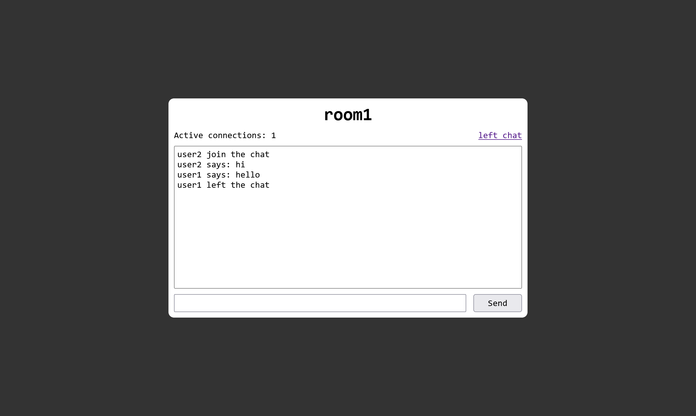

# Simple chat (websocket)
___

___
## Installation
```bash
git clone https://github.com/sivistrukov/simple-chat 
python -m venv venv

# windows
source venv\Scripts\activate
# unix
source venv/bin/activate
pip install -r requirements.txt

cd src/
uvicorn main:app
```